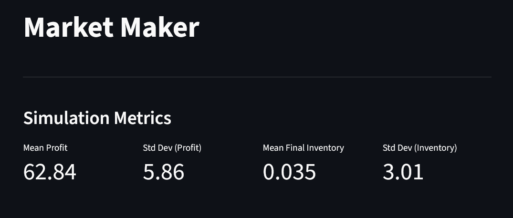
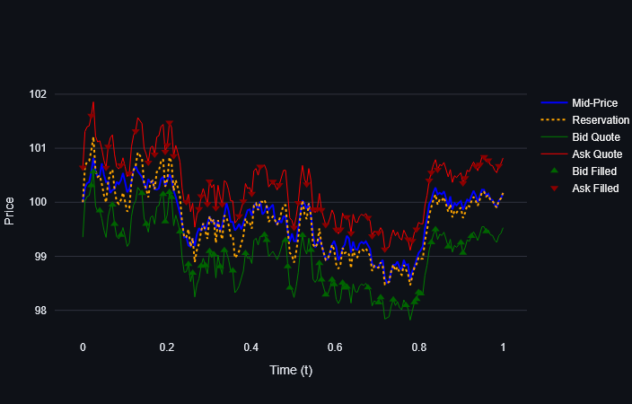
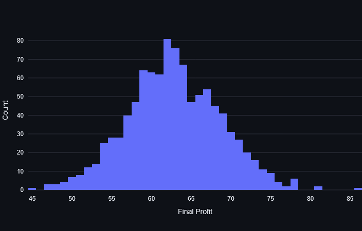

# Market Maker

An implementation and interactive simulation of the Avellaneda-Stoikov (2008) inventory-based market-making model, following:

> Avellaneda, M., & Stoikov, S. (2008). High-frequency trading in a limit order book. *Quantitative Finance*, 8(3), 217–224.

## Overview

explain market making

## Screenshots

**Simulation metrics**



**Path view**



**Profit distribution** — histogram of terminal P&L across simulated paths:




## Running it

Install dependencies:

```bash
pip install streamlit numpy plotly pandas
```

Launch the interactive dashboard:

```bash
streamlit run app.py
```
